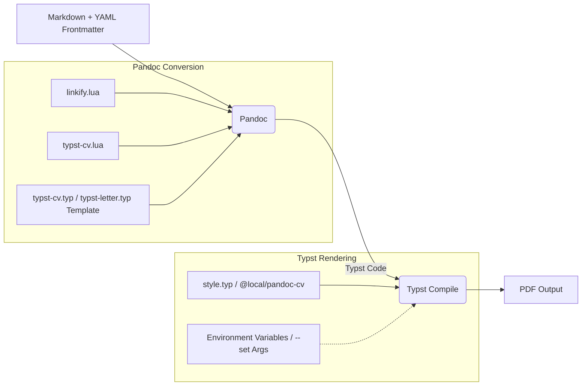

# System Patterns: Typst CV/Letter Generator

## Core Architecture: Pipeline Conversion

The system employs a multi-stage pipeline pattern to convert Markdown input into a final PDF output.

## Key Components & Roles

1.  **Markdown Input:** User provides content and basic metadata (YAML). Uses specific Markdown attributes (`{key=value}`) and classes (`{.class}`) for layout hints.
2.  **Pandoc:** Acts as the central converter.
    *   Parses Markdown and YAML.
    *   Applies Lua filters for transformations.
    *   Uses a Typst template (`.typ`) to structure the output.
    *   Can output either final PDF (simpler cases) or intermediate Typst code.
3.  **Lua Filters (`linkify.lua`, `typst-cv.lua`):** Extend Pandoc's functionality.
    *   `linkify.lua`: Automatically creates hyperlinks based on `links` metadata.
    *   `typst-cv.lua`: Translates Markdown attributes/classes into specific Typst function calls (e.g., `#body-side`, `#hidden-heading`), decoupling Markdown syntax from Typst implementation details.
4.  **Typst Templates (`typst-cv.typ`, `typst-letter.typ`):** Basic structure files used by Pandoc. They primarily import the main style package and pass metadata.
5.  **Typst Style Package (`style.typ` / `@local/pandoc-cv`):** Contains the core Typst logic.
    *   Defines document structure, page layout, fonts, colors.
    *   Implements the functions called by `typst-cv.lua` (e.g., `body-side`, `hidden-heading`).
    *   Handles metadata passed from templates (`setup-style` function).
    *   Accesses override variables (`sys.inputs`) provided during Typst compilation.
6.  **Build Script (`build.sh` - Proposed):** Orchestrates the pipeline.
    *   Parses user arguments (input file, overrides, output options).
    *   Selects the appropriate Pandoc template.
    *   Detects override variables (`TYPSTCV_*` env vars, `--set` args).
    *   Chooses the correct pipeline (direct Pandoc-to-PDF or Pandoc-to-Typst | Typst Compile) based on whether overrides are needed or stdout is used.
    *   Constructs and executes the final `pandoc` and `typst` commands.
7.  **Docker (`Dockerfile`):** Packages the entire environment (dependencies, filters, templates, styles, build script) for reproducible execution. The entrypoint will be set to `build.sh`.

## Key Design Decisions (Current & Proposed)

-   **Markdown as Source:** Prioritizes ease of writing for the user.
-   **Pandoc as Bridge:** Leverages Pandoc's robust Markdown parsing and filter capabilities.
-   **Lua Filters for Customization:** Encapsulates custom Markdown-to-Typst translation logic.
-   **Typst for Layout:** Utilizes Typst's modern typesetting features for high-quality output.
-   **Decoupled Styling:** Centralizes Typst styling logic in `style.typ` (via local package).
-   **Script-based Interface (Proposed):** Replaces rigid `justfile` with a flexible `build.sh` for better usability and integration.
-   **Environment/Arg Overrides (Proposed):** Provides a standard mechanism (`TYPSTCV_*`, `--set`) for customizing output without modifying source files.
-   **Docker for Distribution:** Ensures consistent environment and simplifies setup.
